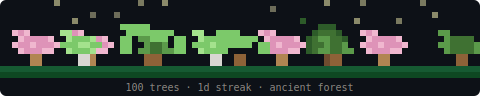

<div align="center">

# Honeytree

**Grow a pixel-art forest in your terminal every time you use Claude Code.**


[](https://www.npmjs.com/package/honeytree)
[](https://github.com/Varun2009178/honeytree/blob/main/LICENSE)

Each prompt plants a new tree. Each tree grows over time. Your forest evolves from a clearing into an ancient woodland — and it never resets.

</div>

---

## Quick Start

```bash
npm install -g honeytree
honeytree init
honeytree
```

**That's it.** Three commands:

1. **Install** — installs the CLI globally
2. **Init** — creates your forest and registers a [Claude Code hook](https://docs.anthropic.com/en/docs/claude-code/hooks) that plants a tree after every response
3. **View** — opens the live viewer in your terminal (run this in a separate terminal pane)

After init, trees are planted automatically. No manual steps needed. Just keep using Claude Code and watch your forest grow.

---

## How It Works

`honeytree init` does two things:

1. Creates `~/.honeydew/forest.json` — your persistent forest state
2. Adds a `Stop` hook to `~/.claude/settings.json` — runs `honeytree plant` after every Claude Code response

Every response plants a tree at a random position, with a random species and growth stage. Existing trees grow a little each time too.

Open the viewer (`honeytree`) in a second terminal to watch it happen in real time. The viewer auto-updates when new trees appear — no refreshing needed.

---

## Panning

Your forest is wider than your terminal. Use **left/right arrow keys** to pan across the full canvas and explore your forest.

When a new tree is planted, the viewer automatically scrolls to show it. A minimap in the stats bar shows your current position.

---

## Streaks

Honeytree tracks your coding streak — consecutive days using Claude Code.

- **Active streak** — displayed in the stats bar (e.g. `7-day streak`)
- **Broken streak** — miss a day and your forest starts **wilting**: trees desaturate toward brown, fog rolls in
- **Recovery** — your next prompt clears the wilting immediately

| Days idle | Effect |
|----------:|--------|
| 1 | Light desaturation, sparse fog |
| 2 | Noticeable browning, moderate fog |
| 3 | Heavy browning, dense fog |
| 4+ | Near-dead forest, thick fog |

Plant a tree to bring it back to life.

---

## Biomes

Your forest evolves visually as it grows:

| Trees | Biome | What changes |
|------:|-------|-------------|
| 0-9 | Clearing | Sparse stars, light ground |
| 10-24 | Grove | Stars and ground details appear |
| 25-49 | Woodland | Dense canopy, mushrooms and bushes on the ground |
| 50-99 | Old Growth | Deep greens, fallen leaves, full underbrush |
| 100+ | Ancient Forest | Richest palette, lush ground cover, brightest sky |

Trees are never deleted. The forest only grows.

---

## Tree Species

Five species, randomly assigned at planting:

| Species | Look |
|---------|------|
| Oak | Wide, rounded canopy |
| Pine | Tall, triangular shape |
| Birch | Light trunk, bright leaves |
| Willow | Drooping canopy |
| Cherry | Pink blossoms |

Each species has 4 growth stages: seed, sapling, young, full. Existing trees grow a little with each new prompt.

---

## Badge

Add a live badge to any repo's README:

```bash
honeytree badge
```

Creates `honeytree-badge.svg` in your current directory. Embed it with:

```markdown
[](https://github.com/Varun2009178/honeytree)
```

| State | Badge color | Example |
|-------|-------------|---------|
| Active streak | Green | `42 trees · 7d streak` |
| Wilting | Orange-red | `42 trees · wilting` |
| No streak data | Grey | `42 trees` |

Re-run `honeytree badge` to update with latest stats.

---

## FOREST.md

Generate a shareable markdown snapshot:

```bash
honeytree md
```

Creates `FOREST.md` with your badge, stats, a plain-text rendering of your forest, and total prompts. Commit it to your repo so your team can see the forest.

---

## CLI Reference

| Command | Description |
|---------|-------------|
| `honeytree init` | Create forest and register Claude Code hook |
| `honeytree` | Launch the live viewer |
| `honeytree plant` | Plant a tree manually |
| `honeytree badge` | Generate `honeytree-badge.svg` |
| `honeytree md` | Generate `FOREST.md` |

---

## Stats Bar

The viewer shows a stats bar below your forest:

```
 honeytree · 42 trees · 7-day streak · ████████░░░░ next: oak [woodland] [═══─────────]
```

| Segment | Meaning |
|---------|---------|
| `42 trees` | Total trees planted (one per prompt, never deleted) |
| `7-day streak` | Consecutive days using Claude Code |
| `████████░░░░` | Progress toward next milestone (10, 25, 50, 100, 250, 500, 1000) |
| `next: oak` | Species of the next tree |
| `[woodland]` | Current biome |
| `[═══─────────]` | Viewport minimap (position in the full forest) |

---

## Requirements

- Node.js 18+
- [Claude Code](https://docs.anthropic.com/en/docs/claude-code) (for the automatic hook)

## Links

- **npm**: [npmjs.com/package/honeytree](https://www.npmjs.com/package/honeytree)
- **GitHub**: [github.com/Varun2009178/honeytree](https://github.com/Varun2009178/honeytree)
- **Issues**: [github.com/Varun2009178/honeytree/issues](https://github.com/Varun2009178/honeytree/issues)

## License

MIT
